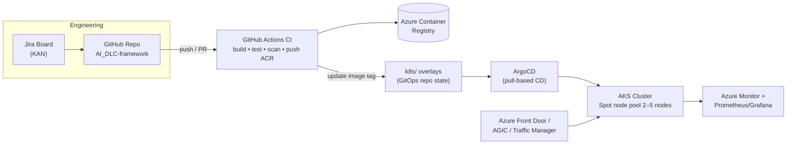

# AI-DLC Framework — AKS GitOps Reference Implementation

An **AI-Driven Development LifeCycle (AI-DLC)** reference framework that provisions and operates a
simple web application on **Azure Kubernetes Service (AKS)** using Terraform, GitHub Actions,
Azure Container Registry (ACR), ArgoCD (GitOps), and Jira — with guardrails, approvals, and a
Dev → Stage → Prod promotion model.

## Architecture at a glance

## Repository layout

| Path | Contents |
|------|----------|
| `docs/` | AI-DLC overview, HLD (diagrams), LLD steps, traffic management, best practices, rollback, validation checklists, Jira integration |
| `app/` | Sample Node.js web app + Dockerfile + tests |
| `terraform/` | Root module + `modules/` (network, aks, acr, frontdoor, trafficmanager, monitoring) + per-env `environments/*.tfvars` |
| `k8s/` | Kustomize `base/` + `overlays/{dev,stage,prod}` — the GitOps desired state |
| `argocd/` | AppProject + Application CRDs for Dev/Stage/Prod |
| `.github/workflows/` | CI (build/test/scan/push), CD per environment, Terraform plan/apply, scheduled security scans |
| `policies/` | Checkov config, OPA/Conftest Rego, Gatekeeper constraints |
| `scripts/` | ArgoCD bootstrap, rollback, smoke test |

## Quick start

1. **Prereqs:** Azure subscription `995377ec-18d5-43bb-98db-74ab68a2ef8f`, `az`, `terraform >= 1.6`,
   `kubectl`, `kustomize`, `argocd` CLI. Configure the GitHub secrets/variables listed in
   [`docs/03-lld.md`](docs/03-lld.md).
2. **Provision infra:** `cd terraform && terraform init && terraform apply -var-file=environments/dev.tfvars`
3. **Bootstrap GitOps:** `./scripts/bootstrap-argocd.sh`
4. **Deploy:** merge a PR to `main` — CI builds/scans/pushes to ACR, the CD workflow updates the
   Kustomize overlay, and ArgoCD converges the cluster.

## Key design choices

- **Cost-optimised compute:** dedicated **Spot node pool**, autoscaled **min 2 / max 5** nodes, with
  a small on-demand system pool for control-plane-adjacent workloads.
- **Pull-based GitOps:** ArgoCD inside the cluster reconciles `k8s/` — CI never holds cluster
  credentials, and rollback is a `git revert` or `argocd app rollback`.
- **Environment guardrails:** GitHub Environments (dev → stage → prod) enforce reviewer approvals;
  Jira issue keys gate promotion via `gajira` transitions.
- **Defense-in-depth scanning:** Trivy (image), Checkov (IaC), Conftest/OPA (manifests), CodeQL
  (source), Gatekeeper (in-cluster policy).

See [`docs/02-hld.md`](docs/02-hld.md) for the full high-level design and diagrams.
