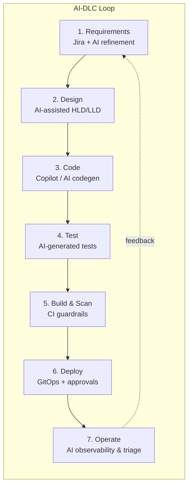

# 01 — AI-DLC Overview

## What is AI-DLC?

**AI-DLC (AI-Driven Development Life Cycle)** is a software *delivery methodology* — **not an
application**. It embeds AI assistance into every phase of the software delivery lifecycle — not
as a bolt-on, but as a first-class participant with defined inputs, outputs, and human approval
gates.

This repository **implements the AI-DLC model**: the sample webapp in `app/` is only the demo
workload that flows through the lifecycle; the framework itself is the pipeline, guardrails, and
GitOps machinery around it.

## How AI is embedded in this framework

| Phase | AI capability | Where it lives |
|-------|---------------|----------------|
| Requirements | AI-assisted Jira story refinement, acceptance-criteria generation | Jira board `KAN` (docs/08) |
| Design | This HLD/LLD + Terraform/YAML generated by AI-DLC agent | `docs/`, `terraform/`, `k8s/` |
| Code review | AI PR triage bot: risk flags, Jira-key check, gate checklist | `.github/workflows/ai-pr-triage.yml` |
| Testing | AI-generated unit tests (`app/test/`), smoke-test script | `scripts/smoke-test.sh` |
| Pipeline | AI failure triage / risk summarisation hook points | CI workflows (extensible to Azure OpenAI) |
| Deploy | Automated promotion with guardrails; AI-assisted release notes | `cd-promote.yml` |
| Operate | Container Insights + App Insights anomalies → AI alert triage | `terraform/modules/monitoring` |

## Guiding principles

1. **Human-in-the-loop at trust boundaries.** AI proposes; humans approve (PR reviews, GitHub
   Environment gates, Jira approvals).
2. **Git is the single source of truth.** Infra (Terraform) and desired app state (Kustomize) live
   in this repo; ArgoCD converges the cluster.
3. **Shift-left guardrails.** Scans and policy checks run in CI before anything reaches a cluster;
   Gatekeeper enforces the same rules in-cluster.
4. **Cost-aware by default.** Spot node pool (min 2 / max 5), autoscaled everything, per-env SKUs.
5. **Recover fast.** GitOps revert + ArgoCD rollback + `kubectl rollout undo` — three rungs of
   rollback, all documented and scripted.
