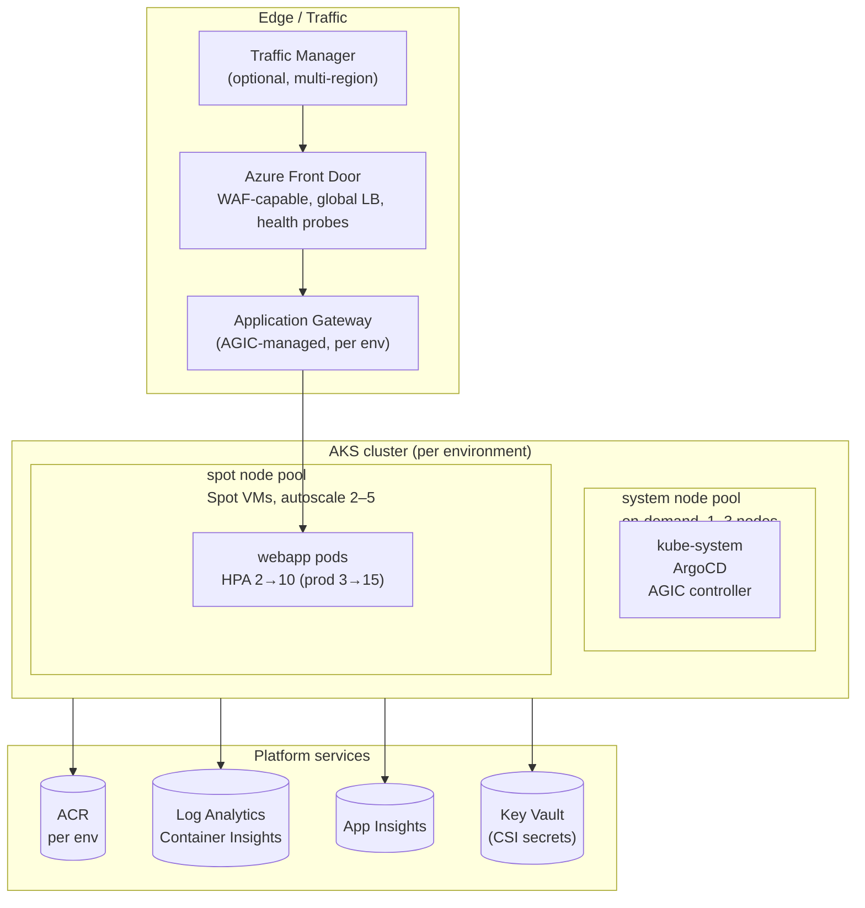
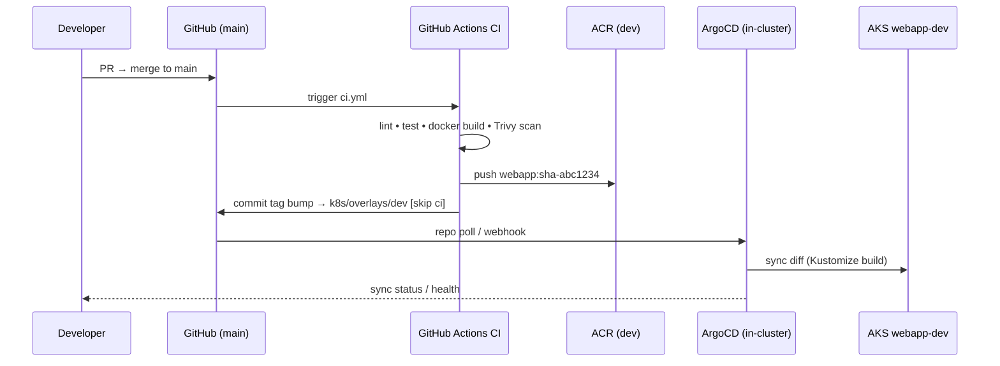
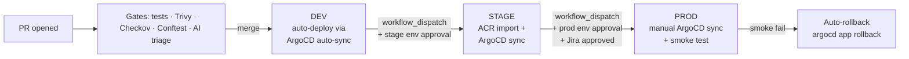
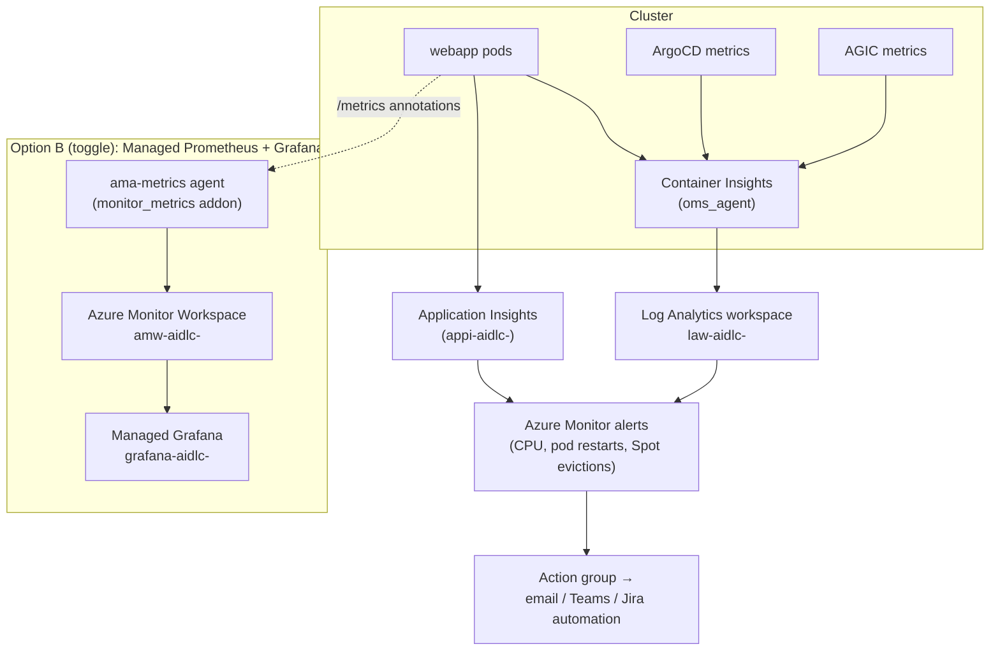

# 02 — High-Level Design (HLD)

## 1. Solution overview

A delivery platform built following the **AI-DLC (AI-Driven Development Life Cycle)**
methodology, demonstrated with a containerised sample web application on **Azure AKS**:

- **Compute:** AKS with an on-demand *system* pool and a **Spot user pool (autoscale 2–5 nodes)**
- **Registry:** Azure Container Registry (ACR), one per environment
- **Ingress/traffic:** Application Gateway Ingress Controller (AGIC) → Azure Front Door →
  (optional) Traffic Manager
- **CI:** GitHub Actions — build, unit test, Trivy image scan, push to ACR
- **CD:** GitOps via **ArgoCD** — pull-based reconciliation of `k8s/` overlays
- **Governance:** Dev → Stage → Prod promotion with GitHub Environment approvals + Jira gates
- **Observability:** Log Analytics (Container Insights) + Application Insights
- **Guardrails:** Checkov (IaC), Trivy (images/fs), Conftest/OPA (manifests), CodeQL (source),
  Gatekeeper (in-cluster), Azure Policy (cluster add-on)

**Subscription:** `995377ec-18d5-43bb-98db-74ab68a2ef8f` · **Repo:**
`github.com/esarath/AI_DLC-framework` · **Jira:** `adminebooks.atlassian.net` project `KAN`

## 2. High-level architecture

## 3. GitOps flow

Key property: **CI never touches the cluster.** It writes desired state to git; ArgoCD (inside the
cluster, with its own identity) pulls and applies. Rollback = revert the git commit.

## 4. CI/CD pipeline (promotion model)

| Env | Trigger | Approvals | ArgoCD sync | ACR |
|-----|---------|-----------|-------------|-----|
| dev | merge to `main` | PR review | automated (prune+selfHeal) | `acraidlcdev` |
| stage | `workflow_dispatch` | `stage` environment reviewers | automated | `acraidlcstage` |
| prod | `workflow_dispatch` | `prod` environment + Jira approval | manual (explicit `argocd app sync`) | `acraidlcprod` |

## 5. AKS cluster design

| Component | Choice | Rationale |
|-----------|--------|-----------|
| Node pools | `system` (on-demand D2s_v5, 1–3) + `spot` (D4s_v5, **2–5**) | System pods insulated from evictions; workloads ride cheap Spot capacity |
| Spot config | `eviction_policy=Delete`, `spot_max_price=-1` | Pay up to PAYG price; evict on capacity reclaim only |
| Spot isolation | Taint `scalesetpriority=spot:NoSchedule` + pod toleration | Only opted-in workloads land on Spot |
| Networking | Azure CNI + Azure network policy, dedicated `snet-aks` | Real pod IPs, NSG-capable |
| Ingress | AGIC addon managing a Standard_v2 App Gateway | L7 routing, AGIC reconciles from Ingress objects |
| Identity | SystemAssigned + OIDC issuer + workload identity | Keyless auth to ACR/Key Vault; GitHub OIDC for CI |
| Policy | `azure_policy_enabled` + Gatekeeper constraints | Prevent drift from guardrails |
| Secrets | Key Vault CSI driver w/ rotation | Secrets never in git |
| Monitoring | `oms_agent` → Log Analytics; App Insights | Container + app telemetry |

## 6. Monitoring & observability stack

**Alternate stack available:** set `enable_managed_prometheus_grafana = true` to provision Azure
Managed Prometheus (Azure Monitor Workspace + ama-metrics DCR pipeline) and Azure Managed Grafana —
standalone or alongside Option A. Full comparison and setup: `docs/09-monitoring-options.md`.

## 7. Environments & isolation

| Concern | dev | stage | prod |
|---------|-----|-------|------|
| Resource group | `rg-aidlc-dev` | `rg-aidlc-stage` | `rg-aidlc-prod` |
| AKS cluster | `aks-aidlc-dev` | `aks-aidlc-stage` | `aks-aidlc-prod` |
| Namespace | `webapp-dev` | `webapp-stage` | `webapp-prod` |
| ACR | `acraidlcdev` | `acraidlcstage` | `acraidlcprod` (Premium) |
| Front Door | yes | yes | yes + Traffic Manager |
| Log retention | 30d | 30d | 90d |
| Approvals | PR only | env reviewers | env reviewers + Jira |

## 8. Security & governance guardrails (summary)

| Layer | Control | Enforcement point |
|-------|---------|-------------------|
| Source | Branch protection on `main`, CODEOWNERS, PR template | GitHub |
| Source | Jira key in PR title (KAN-n) | AI triage workflow warns |
| CI | Unit tests, Trivy HIGH/CRITICAL fail, Checkov, Conftest | `ci.yml`, `terraform.yml`, `security-scan.yml` |
| Registry | `az acr import` promotion — image never rebuilt per env | `cd-promote.yml` |
| Cluster | Azure Policy addon, Gatekeeper constraints, read-only root FS | Terraform + `policies/` |
| Deploy | GitHub Environments approvals; Jira transition gates | `cd-promote.yml` |
| Runtime | HPA, PDB, Spot toleration + anti-affinity, health probes | `k8s/base/` |
| Post-deploy | Smoke test → auto `argocd app rollback` on failure | `cd-promote.yml`, `scripts/` |
