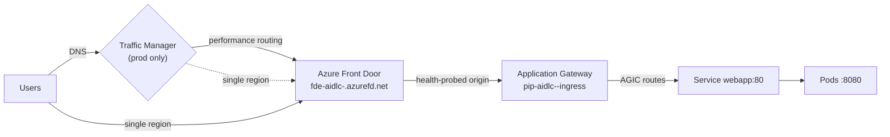

# 04 — Traffic Management: Front Door / AGIC / Traffic Manager

## Traffic path

## Layer responsibilities

| Layer | Role | Config location |
|-------|------|-----------------|
| **AGIC** | L7 ingress inside region — watches Ingress CRs, programs AppGW pools/listeners/rules | `k8s/base/ingress.yaml` annotations; addon in `modules/aks` |
| **Application Gateway** | Regional L7 LB/WAF-capable; public frontend = `aidlc-<env>-ingress.eastus.cloudapp.azure.com` | `modules/aks` (brownfield AppGW, AGIC-managed data plane) |
| **Front Door** | Global edge: TLS termination, caching/WAF (Premium), health-probe failover, HTTPS redirect | `modules/frontdoor` |
| **Traffic Manager** | DNS-level routing across regions/profiles (Performance/Weighted/Priority/Geographic) | `modules/trafficmanager` (prod) |

## When to use which

- **AGIC only** — single-region apps needing path-based routing, TLS offload at AppGW.
- **+ Front Door** — global user base, edge TLS, WAF, caching, instant failover between origins.
- **+ Traffic Manager** — multi-region AKS deployments where DNS-based weighted/perf routing or
  gradual regional failover is needed (enabled in `prod.tfvars`).

## Key config details

- Front Door origin points at the **AppGW public FQDN** (`module.aks.ingress_fqdn`); health probe
  `GET /healthz` every 30s; `https_redirect_enabled = true`.
- AppGW (Standard_v2) is Terraform-provisioned with a skeleton rule set; **AGIC mutates the data
  plane**, so `lifecycle.ignore_changes` covers pools/listeners/rules/probes.
- AGIC annotations on the Ingress: health-probe path, request timeout, connection draining.
- For TLS end-to-end in prod: add a cert (Key Vault → AppGW listener), set
  `forwarding_protocol = "HttpsOnly"`, and enable WAF policy on the Front Door SKU upgrade.

## Canary / blue-green options

- **Canary via Traffic Manager**: `Weighted` routing method across two endpoints (e.g., two AKS
  regions or FD endpoints), shift weight 90/10 → 50/50 → 0/100.
- **Canary via Front Door**: two origin groups + route rules on header/path.
- **In-cluster progressive delivery**: Argo Rollouts (future addition) using the same Spot pool.

## Spot interplay

AppGW/AGIC backends are Kubernetes Services, so Spot evictions only shrink pod count — HPA +
cluster autoscaler (2–5) replenish capacity. PDB `minAvailable: 1` plus `min_count=2` guarantees at
least one replica stays schedulable during evictions.
